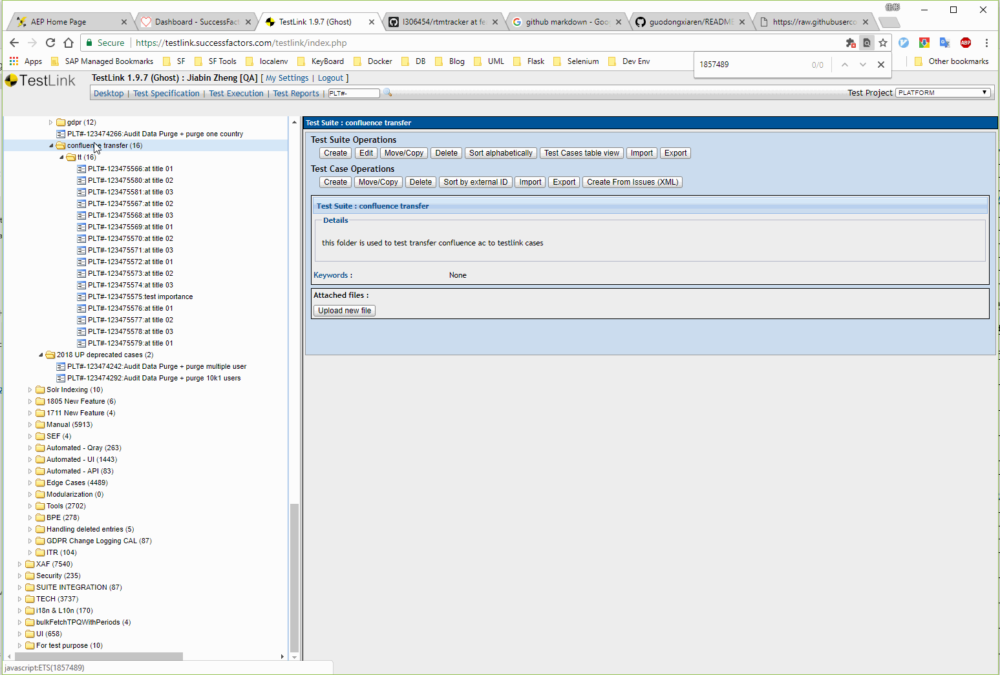
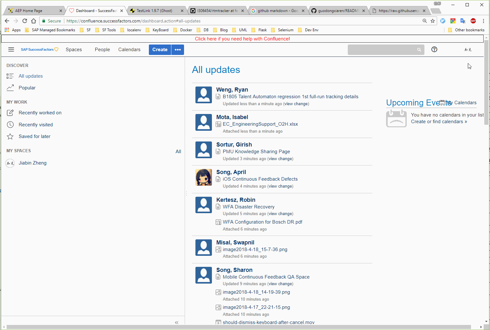

## Usage
* go to the confluence page you record acceptance criteria
* select 'page information' under this tag '...', you will see the page id in url
* run python srcipt with command: python ac_transer_from_confluence_to_testlink.py pageid     

## Install testlink lib
1. this project need testlink lib to communication with testlink so make sure you have installed lib before you run command
 +. How to install: pip install -r requirements.txt
2. this project need python3 and not work under under python2

## Get parameter you need when run script
### Get parameter from testlink
* navigate to the folder you want to insert test case, and click it
* get project id, search by keyword of project like 'platform'
* get folder id, search by keyword of 'containerid'

### Get page id from confluence
* navigate to the confluence page you need to process, select the page info, you will get the id

## Phase I:
1. confluence with story and ac, create a new folder in testlink to store those ac transfered cases
2. run script like transfer.py <page_id> <folder_id>, then cases transfer complete and ret map inserted in the confluence passed

## Phase II to do list:
1. func(pageid, folderid, projectid, author) method to finish case transfer - done
2. give out the interface to set case type, manual/auto - delay

---------------
should be out of maintenance, not sure if it will back

## Phase III to do list:
1. consider about the interface to user, flask? Jenkins?
2. docker impl

we take Jenkins as run platform, reason as below:
1. it's a common used tool of platform team and I want to get more familiar with it
2. we can use jenkins api to kick the job
3. run with parameter to get confluence page id and folder id

## Phase IV to do list:
1. increment impl of create at
2. email user when job finished

-------------------------------------------
